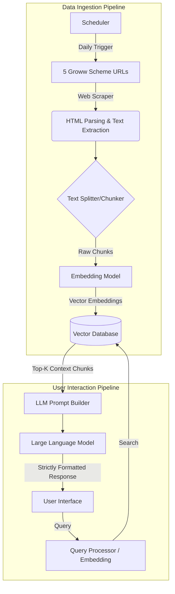

# Architecture Document: Mutual Fund FAQ Assistant (RAG Chatbot)

This document outlines the architecture for the facts-only Mutual Fund FAQ Assistant, designed specifically to retrieve information exclusively from the 5 selected Groww mutual fund URLs (without processing any PDFs). 

## High-Level Architecture Overview

The system follows a standard Retrieval-Augmented Generation (RAG) pipeline tailored for web-based text extraction. It ensures high accuracy, strict compliance with a "facts-only" policy, and robust refusal of advisory questions.

## 1. Data Ingestion & Processing

Since the requirement strictly avoids PDFs, the data ingestion pipeline is entirely focused on web scraping and HTML parsing.

*   **Data Sources**: The exact 5 Groww mutual fund scheme URLs provided in the Corpus Definition.
*   **Web Scraping & Parsing**: Tools like **BeautifulSoup** or **Playwright/Puppeteer** (if JavaScript rendering is required) will be used to fetch and extract raw text from the Groww URLs.
*   **Text Cleaning**: Stripping out irrelevant HTML elements (nav bars, footers, ads) to retain only the core scheme information (Expense ratio, NAV, Exit load, minimum SIP, etc.).
*   **Chunking**: The cleaned text will be split into smaller, overlapping chunks (e.g., using LangChain's `RecursiveCharacterTextSplitter`) to optimize the retrieval process. Each chunk will retain metadata about its source URL.

## 2. Embedding & Vector Storage

*   **Embedding Model**: The BAAI/BGE embedding model (e.g., `BAAI/bge-small-en-v1.5`) will be exclusively used to convert the text chunks into vector embeddings.
*   **Vector Database**: A lightweight vector store will be used to store the embeddings alongside the original text and URL metadata. 
    *   *Recommended Options*: **ChromaDB**, **FAISS**, or **Qdrant** (running locally or via a lightweight cloud instance).

## 3. Retrieval Engine

When a user submits a query:
1.  **Query Embedding**: The user's query is passed through the same embedding model.
2.  **Vector Search**: The system performs a similarity search (e.g., Cosine Similarity) against the Vector Database.
3.  **Context Extraction**: The top-K most relevant chunks (usually 3 to 5 chunks) are retrieved, bringing along their associated source URL metadata.

## 4. Generation & Compliance (LLM Layer)

The generation layer is responsible for strictly adhering to the constraints outlined in the Problem Statement.

*   **Language Model**: An LLM hosted on **Groq** (e.g., Llama-3 or Mixtral via Groq API) will be used to ensure blazing-fast inference speeds.
*   **System Prompting**: The prompt will be heavily engineered to enforce the rules:
    *   *Facts-Only Constraint*: Only use the provided context to answer. If the answer is not in the context, refuse politely.
    *   *No Advice Constraint*: Actively detect queries asking for recommendations (e.g., "Should I invest?") and trigger a refusal response.
    *   *Formatting*: Keep the answer to a maximum of 3 sentences.
    *   *Citation*: Append the exact source URL of the chunk used to generate the answer.
    *   *Footer*: Always include the footer: *“Last updated from sources: <date>”*

## 5. User Interface (UI)

The UI will be clean, minimal, and user-friendly, highlighting the system's boundaries.

*   **Frontend Framework**: A lightweight framework like **Streamlit**, **Gradio**, or a simple **React** app.
*   **Core UI Elements**:
    *   Welcome message & disclaimer ("Facts-only. No investment advice.").
    *   3 quick-start example questions.
    *   Chat interface displaying user queries and assistant responses with embedded citations.

## 6. Scheduler Component

To ensure the chatbot always serves the most up-to-date facts (e.g., NAV, AUM, expense ratios), a scheduler component governs the Data Ingestion Pipeline.

*   **Trigger Mechanism**: A cron job or lightweight task scheduler (e.g., Python `schedule` library) runs daily.
*   **Workflow**: When triggered, it automatically orchestrates Phase 2 (Scraping & Parsing) and Phase 3 (Vector DB rebuilding).
*   **Data Freshness**: By rebuilding the vector index daily, stale data is naturally purged and the Assistant's footer accurately reflects recent updates without manual intervention.

## 7. Known Limitations

*   **Static Corpus**: The database relies on the scheduler trigger to re-scrape the Groww URLs. Intra-day updates to scheme details are not captured until the next scheduled run.
*   **Complex Table Parsing**: Extracting tabular data directly from HTML can sometimes lose context; chunking strategies must be carefully tested to ensure tabular metrics (like returns over 1Y, 3Y, 5Y) are kept intact.
*   **Dependency on Third-Party DOM**: Any structural changes to the Groww website's HTML might break the web scraper, requiring maintenance updates.
